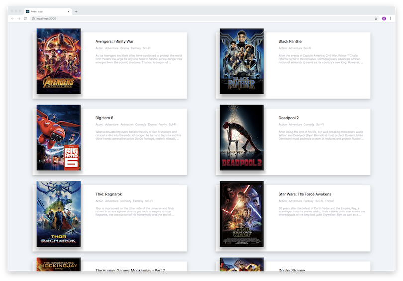

# Movie App
Simple movie app using YTS API

## Reference
[Nomad Coder React Tutorial](https://www.youtube.com/watch?v=sM2p1EqTlw4&index=1&list=PL7jH19IHhOLOFTVD4R8FeZWkwpVi8-9Fv)

## Environment
* OSX High Sierra 10.13.6
* npm 6.4.1
* node 8.12.0

## Result
[Github io link](https://apiacere.github.io/movie-app)
